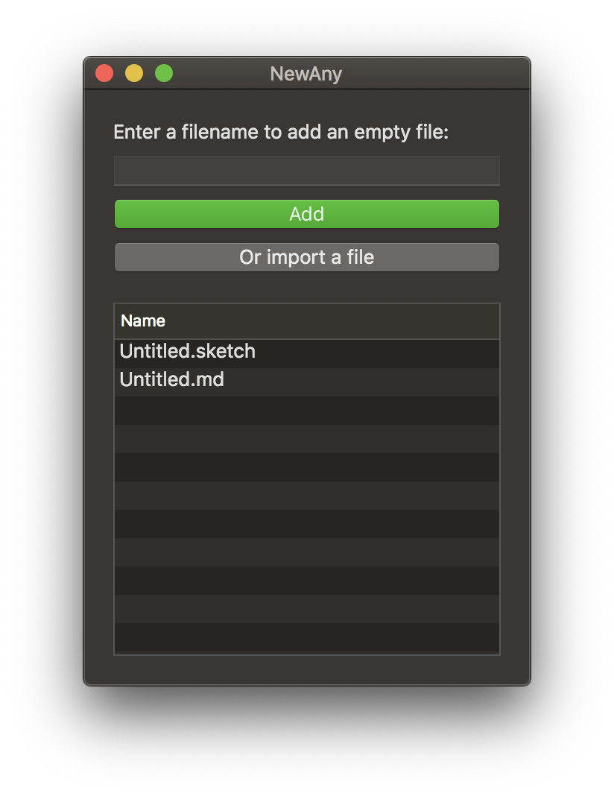
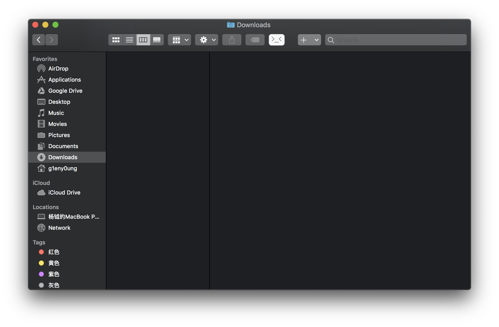

<p align="center">
  
</p>
<h1 align="center">NewAny</h1>
<p align="center">
  
  
  <a href="https://opensource.org/licenses/MIT"></a>
</p>
<p align="center">➕ Finder sync extension let you create any files as you wish.</p>

## Screenshot

<p align="center">
  
</p>

## Use it

Go to [release page](https://github.com/ilime/NewAny/releases)

After running `NewAny.app`, you have to go into your `System Preferences`.

Click `Extensions` -> `Finder Extensions`, then enable **`NewAnyFinder`**.

Open finder:



At last, you can see a ➕ in the toolbar.

After add or import files in `NewAny.app`, you can easily create files in the current folder by click the plus button.

## How to develop

```sh
git clone git@github.com:ilime/NewAny.git && cd NewAny

// Open it with xcode
```

## How to contribute

Pull a request or open an issue to describe your changes or problems

## License

MIT &copy; [ilime](https://github.com/ilime)
